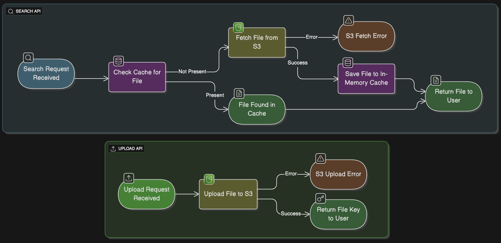

**User Document Data Storage API 📂**

**This repository is a spring boot microservice which has APIs to handle document storage operations into s3 bucket.**

**This microservice has two APIs**
+ **/api/v1/document-storage/search** [GET]
  + Takes fileName and userName in requestParams
  + Saves the file in cache and returns it if file is present in S3, or gives error.
  
+ **/api/v1/document-storage/upload** [POST]
  + This API accepts multipart file and userName in requestParams.
  + uploads the given file into s3 and returns the fileKey.

**Flow Diagram:**

**How to run the microservice🚀**

+ Clone this repository
+ Export the following environment variable before you run the application
+ AWS_ACCESS_KEY_ID - your aws access key
+ AWS_SECRET_KEY - your aws access key secret
+ AWS_REGION - your AWS region, if not provided ap-south-1 is considered default
+ S3_STORAGE_PREFIX - if you want to give a base directory from where the files need to be saved and searched, ignore if you want to store in principal directory i.e /
+ S3_BUCKET_NAME - your s3 bucket name
+ That's it you will be able to run the microservice.

